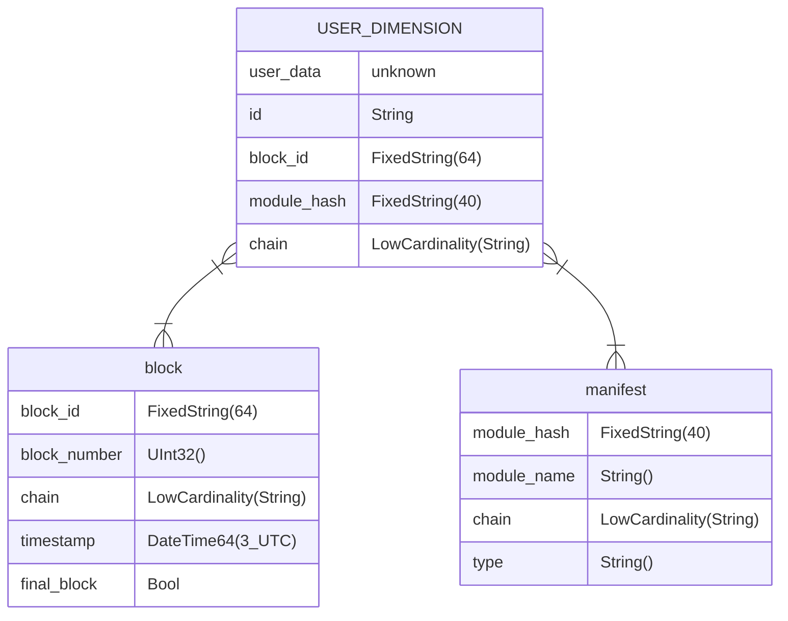

# Substreams ClickHouse Sink CLI

`substreams-sink-clickhouse` is a tool to pipe in data from the blockchain into a ClickHouse database.

## [Pre-built binaries](https://github.com/pinax-network/substreams-sink-clickhouse/releases)

- Linux

## Installation

Globally via npm **(Not deployed on NPM yet)**

```
$ npm i -g substreams-sink-clickhouse
```

### Environment variables

These can all be set when starting the sink. See [cli structure](#cli-structure).

```bash
# ./.env
# Optional fields

PUBLIC_KEY=... # Provided by substreams-sink-webhook
AUTH_KEY=... # Generate in Node via `require("crypto").randomBytes(64).toString('base64')` or leave empty if no auth is required

DB_HOST=http://127.0.0.1:8123
DB_NAME=clickhouse_sink
DB_USERNAME=default
DB_PASSWORD=
CREATE_DB=false

P_QUEUE_LIMIT=10
P_QUEUE_CONCURRENCY=10

SCHEMA_URL=...
VERBOSE=true
```

## Usage

Endpoint summary available on [http://localhost:3000](http://localhost:3000).

```bash
substreams-sink-clickhouse --help
```

### Database initialization

Create a database in ClickHouse. (Optionally, skip this step and use the `default` database.)

```bash
substreams-sink-clickhouse --create-db --name <DB_NAME>
```

### Schema initialization

Initializes the database according to a SQL file. See [example file](#example-sql-file).

**CLI**

```
substreams-sink-clickhouse --schema-url <SCHEMA_URL>
```

**Web UI**

Upload a `.sql` file on [http://localhost:3000](http://localhost:3000). (POST request `/schema`, Content-Type: `application/octet-stream`)

**Curl**

```bash
curl --location --request POST 'http://localhost:3000/schema' --header 'Authorization: Bearer <AUTH_KEY>' --header 'Content-Type: application/json' --data-raw '<SQL_INSTRUCTIONS>'
```

#### Example SQL file

<details>
<summary>Click to expand</summary>

```sql
CREATE TABLE IF NOT EXISTS contracts (
    address  FixedString(40),
    name     Nullable(String),
    symbol   Nullable(String),
    decimals Nullable(UInt8)
)
ENGINE = ReplacingMergeTree
ORDER BY (address)
```

</details>

### Sink

Serves an endpoint to receive Substreams data from [substreams-sink-webhook](https://github.com/pinax-network/substreams-sink-webhook).

Endpoints are detailed on [http://localhost:3000](http://localhost:3000).

```bash
substreams-sink-clickhouse
# or
bun start
```

#### CLI structure

| Flags                   | Arguments               | Default                 | Description                                                                                                       |
| ----------------------- | ----------------------- | ----------------------- | ----------------------------------------------------------------------------------------------------------------- |
| `-p`, `--port`          | `<port>`                | `3000`                  | HTTP port on which to attach the sink                                                                             |
| `-v`, `--verbose`       | -                       | `"pretty"`              | Enables logs.                                                                                                     |
| `-s`, `--schema-url`    | `[schema-url]`          | `SCHEMA_URL` in `.env`  | URL to a `.sql` file to execute before starting the sink                                                          |
| `--key`                 | `[public-key]`          | -                       | Public key to validate messages                                                                                   |
| `--auth`                | `[auth-key]`            | `""`                    | Auth key to validate requests                                                                                     |
| `--host`                | `[hostname]`            | `http://localhost:8123` | Database HTTP hostname                                                                                            |
| `--name`                | `[db-name]`             | `default`               | The database to use inside ClickHouse                                                                             |
| `--user`                | `[db-user]`             | `default`               | Database user                                                                                                     |
| `--password`            | `[db-password]`         | `""`                    | Password associated with the specified username                                                                   |
| `--create-db`           | -                       | -                       | Creates the requested database if it does not exist                                                               |
| `--async-insert`        | `<async-insert>`        | 1                       | See [ClickHouse documentation](https://clickhouse.com/docs/en/operations/settings/settings#async-insert)          |
| `--wait-insert`         | `<wait-insert>`         | 0                       | See [ClickHouse documentation](https://clickhouse.com/docs/en/operations/settings/settings#wait-for-async-insert) |
| `--p-queue-limit`       | `<p-queue-limit>`       | 10                      | Defines how many promises can be pending before delaying responses                                                |
| `--p-queue-concurrency` | `<p-queue-concurrency>` | 10                      | See [PQueue documentation](https://github.com/sindresorhus/p-queue#concurrency)                                   |

## Database structure

The `USER_DIMENSION` is generated by the user provided schema and is augmented by a few columns.



**Indexes**

| Table          | Fields                                     |
| -------------- | ------------------------------------------ |
| USER_DIMENSION | `(chain, module_hash)` `(chain, block_id)` |
| block          | `(block_id, block_number, timestamp)`      |
| manifest       | `module_hash`                              |

## Planned features

See [issues](https://github.com/pinax-network/substreams-sink-clickhouse/issues)
