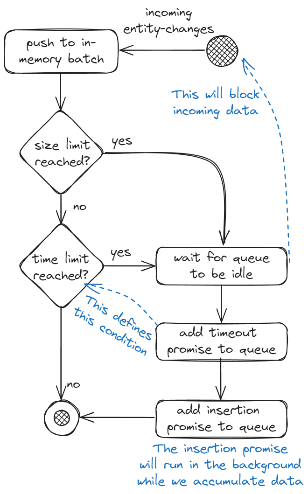
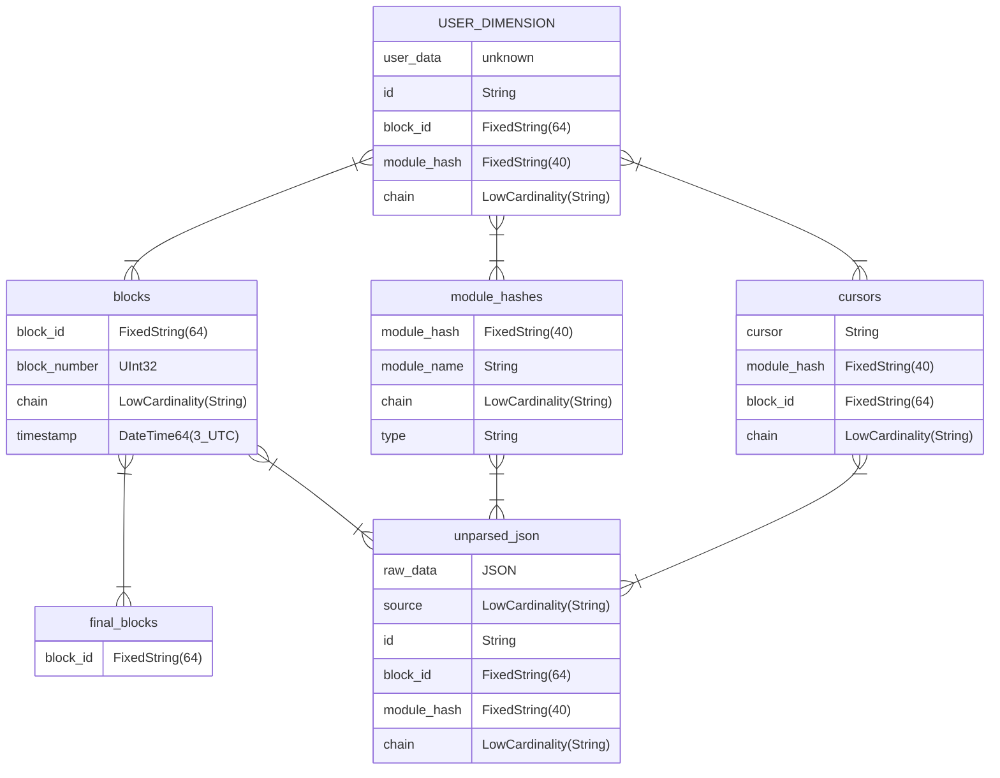

# Substreams ClickHouse Sink CLI

`substreams-sink-clickhouse` is a tool to pipe in data from the blockchain into a ClickHouse database.

## [Pre-built binaries](https://github.com/pinax-network/substreams-sink-clickhouse/releases)

- Linux

## Features

<details>
<summary><b>Serverless data sinking</b></summary>

By using this sink with [substreams-sink-webhook](https://github.com/pinax-network/substreams-sink-webhook), data from any substreams is available in ClickHouse easily.

</details>

<details>
<summary><b>Automatic block information</b></summary>

Data for each block is stored alongside every record. The fields and their structure can be found in the [database structure](#database-structure).

</details>

<details>
<summary><b>SQL schemas</b></summary>

A schema can be passed in to define the end table for substreams data. It will be extended as described in the [database structure](#database-structure).

They can be set according to the steps in [database initialization](#database-initialization).

</details>

<details>
<summary><b>GraphQL schemas</b></summary>

[TheGraph's GraphQL entity](https://thegraph.com/docs/en/developing/creating-a-subgraph/#defining-entities) schemas can be passed in to define the end table for substreams data. See [database initialization](#database-initialization).

They are converted to SQL following these rules before being executed. The available types are defined [here](https://thegraph.com/docs/en/developing/creating-a-subgraph/#graphql-supported-scalars).

| GraphQL data type | ClickHouse equivalent |
| ----------------- | --------------------- |
| `Bytes`           | `String`              |
| `String`          | `String`              |
| `Boolean`         | `boolean`             |
| `Int`             | `Int32`               |
| `BigInt`          | `String`              |
| `BigDecimal`      | `String`              |
| `Float`           | `Float64`             |
| `ID`              | `String`              |

</details>

<details>
<summary><b>NO schema</b></summary>

No schema is required to store data in ClickHouse. Everything can be stored in `unparsed_json` (see [database structure](#database-structure)).

The user **must** build custom [views](https://clickhouse.com/docs/en/guides/developer/cascading-materialized-views) to transform the data according to their needs. Further details are available in [ClickHouse's documentation](https://clickhouse.com/docs/en/integrations/data-formats/json#using-materialized-views).

### Example:

This `MaterializedView` will store every key found in the substreams provided data in the `substreams_keys` table.

```sql
CREATE TABLE substreams_keys (
	source String,
	keys   Array(String),
)
ENGINE MergeTree
ORDER BY (source)
```

```sql
CREATE MATERIALIZED VIEW substreams_keys_mv
TO substreams_keys
AS
SELECT source, JSONExtractKeys(raw_data) AS keys
FROM unparsed_json
```

```bash
substreams-sink-clickhouse --allow-unparsed true
```

</details>

<details>
<summary><b>Argon2 authentication</b></summary>

Password protected endpoints. Set `AUTH_KEY` in [`.env`](#environment-variables) to enable authentication.

No `AUTH_KEY` will skip authentication checks.

Generate a hash with [`POST http://localhost:3000/hash`](http://localhost:3000/#operations-Usage-post_hash) and set password in `Authorization` header: `Bearer <password>`.

</details>

<details>
<summary><b>Batch insertions</b></summary>

While the data coming from `substreams-sink-webhook` is fast, it is not suited to be directly inserted into ClickHouse. The sink receives many entity changes per second (> 100/s) but [ClickHouse is designed to handle one insertion per second](https://clickhouse.com/docs/en/cloud/bestpractices/bulk-inserts#:~:text=Regardless%20of%20the%20size%20of,one%20insert%20query%20per%20second.). Therefore, the entity changes are locally batched before being sent to ClickHouse. This behavior can be customized via the `--max-buffer-size` and `--insertion-delay` flags (See [usage](#usage)).

The data is buffered in memory while the insertion logic is handled by a [p-queue](https://github.com/sindresorhus/p-queue). The control flow for any incoming entity change is described by the following diagram.



</details>

## Usage

Swagger Docs available on [http://localhost:3000](http://localhost:3000).

```bash
substreams-sink-clickhouse --help

Substreams Clickhouse sink module

Options:
  -V, --version                 output the version number
  -p, --port <number>           HTTP port on which to attach the sink (default: "3000", env: PORT)
  -v, --verbose <boolean>       Enable verbose logging (choices: "true", "false", default: "pretty", env: VERBOSE)
  --public-key <string>         Public key to validate messages (env: PUBLIC_KEY)
  --auth-key <string>           Auth key to validate requests (env: AUTH_KEY)
  --host <string>               Database HTTP hostname (default: "http://localhost:8123", env: HOST)
  --database <string>           The database to use inside ClickHouse (default: "default", env: DATABASE)
  --username <string>           Database user (default: "default", env: USERNAME)
  --password <string>           Password associated with the specified username (default: "", env: PASSWORD)
  --async-insert <number>       https://clickhouse.com/docs/en/operations/settings/settings#async-insert (choices: "0", "1", default: 1, env: ASYNC_INSERT)
  --wait-for-insert <boolean>   https://clickhouse.com/docs/en/operations/settings/settings#wait-for-async-insert (choices: "0", "1", default: 0, env: WAIT_FOR_INSERT)
  --max-buffer-size <number>    Maximum insertion batch size (default: 10_000, env: MAX_BUFFER_SIZE)
  --insertion-delay <number>    Delay between batch insertions (in ms) (default: 2000, env: INSERTION_DELAY)
  --allow-unparsed <boolean>    Enable storage in 'unparsed_json' table (default: false, env: ALLOW_UNPARSED)
  -h, --help                    display help for command
```

### Environment variables

These can all be set when starting the sink. See [usage](#usage).

**.env**

```bash
# Authentication
PUBLIC_KEY=... # Ed25519 Public-key provided by https://github.com/pinax-network/substreams-sink-webhook
AUTH_KEY=... # /schema endpoint is a protected endpoint (uses HTTP Basic authentication)

# HTTP Server
PORT=3000
HOSTNAME=0.0.0.0

# Clickhouse Database
HOST=http://127.0.0.1:8123
DATABASE=default
USERNAME=default
PASSWORD=

# Sink
MAX_BUFFER_SIZE=10000
INSERTION_DELAY=2000
VERBOSE=true
```

## Database structure

The `USER_DIMENSION` is generated by the user provided schema and is augmented by a few columns.



**Indexes**

| Table         | Fields                                       |
| ------------- | -------------------------------------------- |
| blocks        | `(block_id, block_number, chain, timestamp)` |
| module_hashes | `module_hash`                                |
| cursors       | `(cursor, module_hash, block_id)`            |
| unparsed_json | `(source, chain, module_hash, block_id)`     |
| final_blocks  | `block_id`                                   |

### Database initialization

Create a database in ClickHouse and setup the dimension tables.

Use `POST /init` on [http://localhost:3000](http://localhost:3000).

```bash
> curl --location --request PUT 'http://localhost:3000/init' --header 'Authorization: Bearer <AUTH_KEY>
```

### Schema initialization

_This step can be skipped. If so, the data will be stored as-is in the `unparsed_json` table. It should then be parsed by the user with ClickHouse's tools. See this [article](https://clickhouse.com/docs/en/integrations/data-formats/json#using-materialized-views) and [features/no-schema](#features)._

Initializes the database according to a SQL or a GraphQL file. See [example schema files](#schema-examples).

**Web UI**

Upload a schema file on [http://localhost:3000](http://localhost:3000).

_Use PUT `/schema/sql` or PUT `/schema/graphql` with `Content-Type: application/octet-stream`._

Pass in a file url in `schema-url`. This will overwrite the body behavior.

**Curl**

```bash
> curl --location --request PUT 'http://localhost:3000/schema/sql' --header 'Authorization: Bearer <AUTH_KEY>' --header 'Content-Type: application/json' --data-raw '<SQL_INSTRUCTIONS>'

> curl --location --request PUT 'http://localhost:3000/schema/graphql' --header 'Authorization: Bearer <AUTH_KEY>' --header 'Content-Type: application/json' --data-raw '<GRAPHQL_ENTITY>'
```

### Schema examples

<details>
<summary><b>Example SQL file</b></summary>

```sql
CREATE TABLE IF NOT EXISTS contracts (
    address  FixedString(40),
    name     String,
    symbol   String,
    decimals UInt8
)
ENGINE = ReplacingMergeTree
ORDER BY (address)
```

</details>

<details>
<summary><b>Example GraphQL file</b></summary>

```graphql
type Contracts @entity {
  id: ID!
  address: String!
  name: String
  symbol: String
  decimals: BigInt
}
```

</details>

### Sink

Serves an endpoint to receive Substreams data from [substreams-sink-webhook](https://github.com/pinax-network/substreams-sink-webhook).

Endpoints are detailed on [http://localhost:3000](http://localhost:3000).

```bash
substreams-sink-clickhouse
# or
bun start
```
