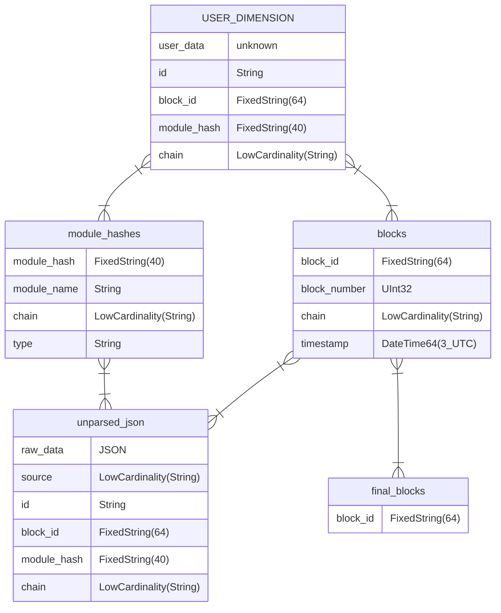

# Substreams ClickHouse Sink CLI

`substreams-sink-clickhouse` is a tool to pipe in data from the blockchain into a ClickHouse database.

## [Pre-built binaries](https://github.com/pinax-network/substreams-sink-clickhouse/releases)

- Linux

## Features

- TO-DO: See [issues](https://github.com/pinax-network/substreams-sink-clickhouse/issues?q=is%3Aissue+is%3Aclosed)

## Usage

Swagger Docs available on [http://localhost:3000](http://localhost:3000).

```bash
substreams-sink-clickhouse --help

Substreams Clickhouse sink module

Options:
  -V, --version                 output the version number
  -p, --port <number>           HTTP port on which to attach the sink (default: "3000", env: PORT)
  -v, --verbose <boolean>       Enable verbose logging (choices: "true", "false", default: "pretty", env: VERBOSE)
  -s, --schema-url <string>     Execute SQL instructions before starting the sink (env: SCHEMA_URL)
  --public-key <string>         Public key to validate messages (env: PUBLIC_KEY)
  --auth-key <string>           Auth key to validate requests (env: AUTH_KEY)
  --host <string>               Database HTTP hostname (default: "http://localhost:8123", env: HOST)
  --database <string>           The database to use inside ClickHouse (default: "default", env: DATABASE)
  --username <string>           Database user (default: "default", env: USERNAME)
  --password <string>           Password associated with the specified username (default: "", env: PASSWORD)
  --create-database <boolean    If the specified database does not exist, automatically create it (default: "false", env: CREATE_DATABASE)
  --async-insert <number>       https://clickhouse.com/docs/en/operations/settings/settings#async-insert (choices: "0", "1", default: 1, env: ASYNC_INSERT)
  --wait-for-insert <boolean>   https://clickhouse.com/docs/en/operations/settings/settings#wait-for-async-insert (choices: "0", "1", default: 0, env: WAIT_FOR_INSERT)
  --queue-limit <number>        Insert delay to each response when the pqueue exceeds this value (default: 10, env: QUEUE_LIMIT)
  --queue-concurrency <number>  https://github.com/sindresorhus/p-queue#concurrency (default: 10, env: QUEUE_CONCURRENCY)
  -h, --help                    display help for command
```

### Environment variables

These can all be set when starting the sink. See [cli structure](#cli-structure).

**.env**

```bash
# Authentication
PUBLIC_KEY=... # Ed25519 Public-key provided by https://github.com/pinax-network/substreams-sink-webhook
AUTH_KEY=... # /schema endpoint is a protected endpoint (uses HTTP Basic authentication)

# HTTP Server
PORT=3000
HOSTNAME=0.0.0.0

# Clickhouse Database
HOST=http://127.0.0.1:8123
DATABASE=default
USERNAME=default
PASSWORD=
CREATE_DB=false

# Sink
QUEUE_LIMIT=10
QUEUE_CONCURRENCY=10
SCHEMA_URL=... # generate SQL schema by providing file (ex: ./schema.sql) or URL path (ex: https://example.com/schema.sql)
VERBOSE=true
```

## Database structure

The `USER_DIMENSION` is generated by the user provided schema and is augmented by a few columns.



**Indexes**

| Table          | Fields                                     |
| -------------- | ------------------------------------------ |
| USER_DIMENSION | `(chain, module_hash)` `(chain, block_id)` |
| block          | `(block_id, block_number, timestamp)`      |
| manifest       | `module_hash`                              |

### Database initialization

Create a database in ClickHouse. (Optionally, skip this step and use the `default` database.)

```bash
substreams-sink-clickhouse --create-db --name <DB_NAME>
```

### Schema initialization

_This step can be skipped. If so, the data will be stored as-is in the `unparsed_json` table. It should then be parsed by the user with ClickHouse's tools. See this [article](https://clickhouse.com/docs/en/integrations/data-formats/json#using-materialized-views)._

Initializes the database according to a SQL or a GraphQL file. See [example schema files](#schema-examples).

**Web UI**

Upload a schema file on [http://localhost:3000](http://localhost:3000).

_Use PUT `/schema/sql` or PUT `/schema/graphql` with `Content-Type: application/octet-stream`._

**Curl**

```bash
> curl --location --request PUT 'http://localhost:3000/schema/sql' --header 'Authorization: Bearer <AUTH_KEY>' --header 'Content-Type: application/json' --data-raw '<SQL_INSTRUCTIONS>'

> curl --location --request PUT 'http://localhost:3000/schema/graphql' --header 'Authorization: Bearer <AUTH_KEY>' --header 'Content-Type: application/json' --data-raw '<GRAPHQL_ENTITY>'
```

### Schema examples

<details>
<summary><b>Example SQL file</b></summary>

```sql
CREATE TABLE IF NOT EXISTS contracts (
    address  FixedString(40),
    name     String,
    symbol   String,
    decimals UInt8
)
ENGINE = ReplacingMergeTree
ORDER BY (address)
```

</details>

<details>
<summary><b>Example GraphQL file</b></summary>

```graphql
type Contracts @entity {
  id: ID!
  address: String!
  name: String
  symbol: String
  decimals: BigInt
}
```

</details>

### Sink

Serves an endpoint to receive Substreams data from [substreams-sink-webhook](https://github.com/pinax-network/substreams-sink-webhook).

Endpoints are detailed on [http://localhost:3000](http://localhost:3000).

```bash
substreams-sink-clickhouse
# or
bun start
```
