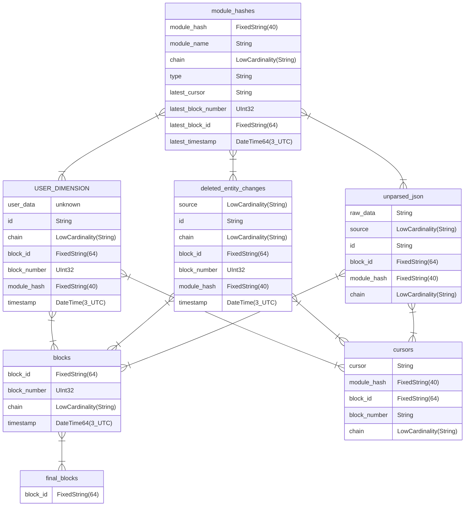
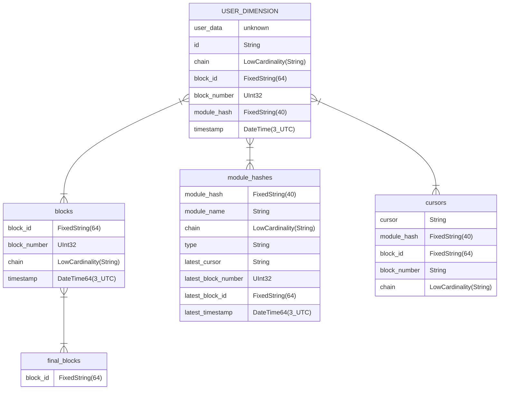
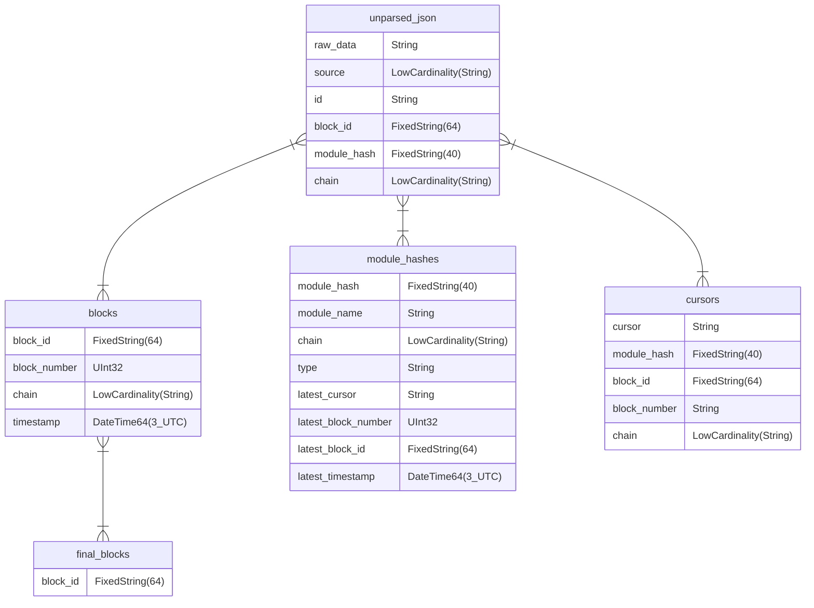

# Database

## Table of contents

- [Complete structure](#complete-structure)
- [Sorting keys](#sorting-keys)
- [Default structure](#default-structure)
- [No schema structure](#no-schema-structure)

## Complete structure

## Sorting keys

| Table                  | Fields                                               |
| ---------------------- | ---------------------------------------------------- |
| blocks                 | `(block_id, chain, block_number, timestamp)`         |
| deleted_entity_changes | `(source, chain, block_number, timestamp, block_id)` |
| module_hashes          | `(chain, module_hash)`                               |
| final_blocks           | `block_id`                                           |
| unparsed_json          | -                                                    |

## Default structure

_Every table is always present. This diagram hides unused tables._

This is the default database structure when using a schema.
`USER_DIMENSION` is replaced by your custom table.
`user_data` stands for every column that will be added.

## No schema structure

_Every table is always present. This diagram hides unused tables._

When no table is found for the incoming substreams and the sink is executed with `--allow-unparsed true`, the received data is inserted in `unparsed_json`. This table has a `NULL` engine. It is intended to be used with a [materialized view](https://clickhouse.com/docs/en/guides/developer/cascading-materialized-views) to fully customize the final data.

See [ClickHouse docs](https://clickhouse.com/docs/en/integrations/data-formats/json#using-materialized-views) for more details.

