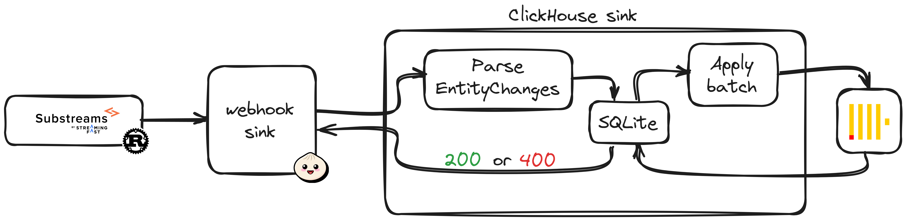

# List of features

## Support for [entity changes](https://crates.io/crates/substreams-entity-change/)

Support for these entity change operations:

- `OPERATION_CREATE`: The received entity changes are directly inserted into ClickHouse according to the provided [schema](#table-initialization).

- `OPERATION_UPDATE`: By default, updates are treated as new items. This allows to build an history of every transaction. If required, previous records can be replaced by specifying the engine as `ReplacingMergeTree`. See this [article](https://clickhouse.com/docs/en/guides/developer/deduplication#using-replacingmergetree-for-upserts).

- `OPERATION_DELETE`: Entity changes are not actually deleted from the database. Again, this allows to build an history of every transaction. The deleted fields are inserted into `deleted_entity_changes`. This table can then be used to filter out deleted data if required.

## Support for [database changes](https://crates.io/crates/substreams-database-change)

The sink accepts [database changes](https://crates.io/crates/substreams-database-change) payloads. The sink only takes into account the `newValue` for every column.<br/>These operations are supported: `OPERATION_CREATE`, `OPERATION_UPDATE` and `OPERATION_DELETE`.

The behavior is the same as for [entity changes](https://crates.io/crates/substreams-entity-change/). Read more [here](#support-for-entity-changes).

## Table initialization

The sink offers many ways to setup a database to store substreams data.<br/>[SQL schemas](#sql-schemas) are the default option, [GraphQL entities](#graphql-schemas) offer the fastest setup and [materialized views](#materialized-view) are more hands on but allow full control on ClickHouse's behavior.

### SQL schemas

_This option is the default way to create a table._

Execute SQL against the database to setup a table.<br/>The sink allows for a remote file as a query parameter. If so, the body is ignored.

```bash
$ curl --location --request PUT "localhost:3000/schema/sql" \
    --header "Content-Type: text/plain" \
    --header "Authorization: Bearer <password>" \
    --data "CREATE TABLE foo () ENGINE=MergeTree ORDER BY();"
$ # OR
$ curl --location --request PUT 'localhost:3000/schema/sql?schema-url=<url>' --header 'Authorization: Bearer <password>'
```

Here is a valid SQL schema. Notice that the sorting key contains an undefined column: `chain`.

```sql
CREATE TABLE IF NOT EXISTS example (
    foo UInt32
)
ENGINE = MergeTree
ORDER BY (chain, foo)
```

This is allowed because the sink injects columns automatically when creating a table.<br/>These are the columns. These names cannot be used in the original schemas.

| Column         | Type                   |
| -------------- | ---------------------- |
| `block_number` | UInt32                 |
| `module_hash`  | FixedString(40)        |
| `timestamp`    | DateTime64(3, 'UTC')   |
| `chain`        | LowCardinality(String) |

### GraphQL schemas

_This option is the fastest option to create a table but allows for less control._

A [GraphQL entity schema](https://thegraph.com/docs/en/developing/creating-a-subgraph/#defining-entities) can be executed against the sink. It is translated into a SQL schema beforehand. The types are converted according to the following rules.

_The available data types are defined [here](https://thegraph.com/docs/en/developing/creating-a-subgraph/#graphql-supported-scalars)._

| GraphQL data type | ClickHouse equivalent |
| ----------------- | --------------------- |
| `Bytes`           | `String`              |
| `String`          | `String`              |
| `Boolean`         | `boolean`             |
| `Int`             | `Int32`               |
| `BigInt`          | `String`              |
| `BigDecimal`      | `String`              |
| `Float`           | `Float64`             |
| `ID`              | `String`              |

The schema is executred as follows.

```bash
$ curl --location --request PUT "localhost:3000/schema/graphql" \
    --header "Content-Type: text/plain" \
    --header "Authorization: Bearer <password>" \
    --data "type foo { id: ID! }"
$ # OR
$ curl --location --request PUT 'localhost:3000/schema/graphql?schema-url=<url>' --header 'Authorization: Bearer <password>'
```

Here is a valid entity schema.

```graphql
type example @entity {
  id: ID!
  foo: Int!
}
```

The **sorting key** is auto-generated. It contains every `ID` field.<br/>The **table engine** cannot be changed.<br/>If more control is required, it is suggested to use [SQL schemas](#sql-schemas).

### Materialized View

_This option is fully hands on. Everything can be configured._

No schema is required to store data in ClickHouse. Everything can be stored in `unparsed_json` (see [database structure](./database.md)).

The user **must** build custom [views](https://clickhouse.com/docs/en/guides/developer/cascading-materialized-views) to transform the data according to their needs. Further details are available in [ClickHouse's documentation](https://clickhouse.com/docs/en/integrations/data-formats/json#using-materialized-views).

The following code will store every key found in the substreams provided data in the `substreams_keys` table.

```sql
CREATE TABLE substreams_keys (
	source String,
	keys   Array(String),
)
ENGINE MergeTree
ORDER BY (source)
```

```sql
CREATE MATERIALIZED VIEW substreams_keys_mv
TO substreams_keys
AS
SELECT source, JSONExtractKeys(raw_data) AS keys
FROM unparsed_json
```

```bash
substreams-sink-clickhouse --allow-unparsed true
```

## Automatic block metadata

Data for each block is stored alongside every record. The fields and their structure can be found in the [database structure](./database.md).

## Serverless

The ClickHouse sink is stateless. It can be scaled as needed.

## Authentication

Some endpoints are protected in the following manner.

### Basic authentication for users

_To disable authentication for users, set `AUTH_KEY=` in `.env`. Suggested for development_

Generate a hash for a password and set in `.env` as `AUTH_KEY`.<br/>
Further PUT requests will require the password in the `Authoriation` header.

```bash
$ curl --location 'localhost:3000/hash' --header 'Content-Type: text/plain' --data '<password>'
```

### ed25519 signatures for [webhooks](https://github.com/pinax-network/substreams-sink-webhook)

Each incoming payload (`POST /webhook`) is expected to be signed with the following headers. This signature is generated by the [webhook sink](https://github.com/pinax-network/substreams-sink-webhook).

```bash
x-signature-ed25519 = <signature>
x-signature-ed25519-expiry = <expiry-unix-format>
x-signature-ed25519-public-key = <public-key>
```

The token must not be expired.<br/>
The public key must be set in the [environment](../README.md#environment). Many public keys can be set in a comma separated list.<br/>
The signature must match the payload `{ exp: <expiry>, id: <id> }`.

If any of these criterias are not met, the sink will return an error code.

## No data loss

The substreams sink ensures no data loss.<br/>
This is done by saving every record locally in SQLite before sending a response to the [webhook sink](https://github.com/pinax-network/substreams-sink-webhook).

SQLite is then periodically saved into ClickHouse when the sink is running.<br/>
It can also be done when starting the sink by setting `--resume true` (on by default).



## Pause

The sink can be paused if needed. This allows ClickHouse to be modified without losing blocks.<br/>
The sink will return **HTTP 400** error code when paused.<br/>
The sink will behave normally when unpaused.

```bash
$ # Pause
$ curl --location --request PUT 'localhost:3000/pause' --header 'Authorization: Bearer <password>'
$ # Unpause
$ curl --location --request PUT 'localhost:3000/unpause' --header 'Authorization: Bearer <password>'
```
